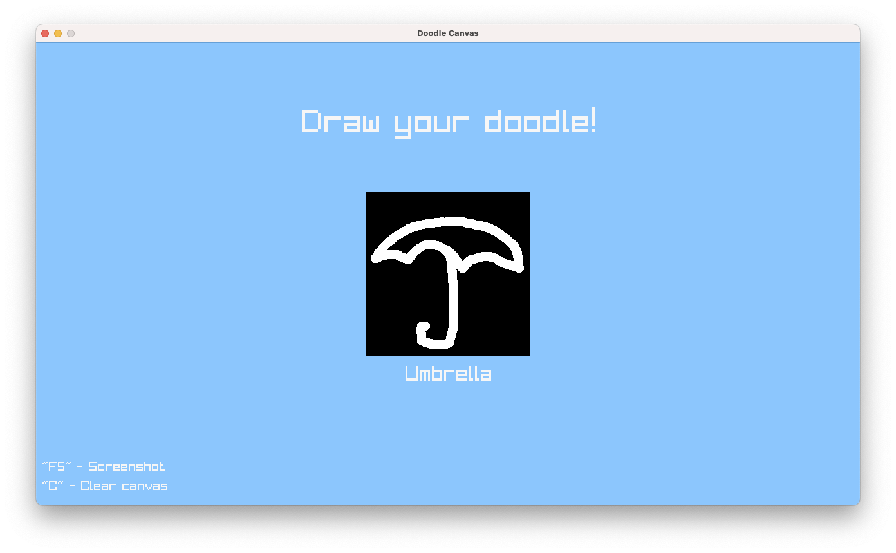

# Interactive Doodle Recognition

This work is a attempt to train a Deep Neural Network to classify doodles from the Google's QuickDraw database.
This project will be presented as a final work at my Master Degree Deep Learning subject.

## What I've learned?
- Some OpenCV;
- How to deal with `.bin` files in C++ and Python;
- How to pre-process image files;
- How to import a Python-trained Tensorflow model into a C++ project;
- More about this amazing library called Raylib;
- Some deep learning;

## TODO
- For now, there are only 20 possible predictions;
- Improves performance, using a lot of CPU instead of GPU to run textures;
- Make a better brush.
